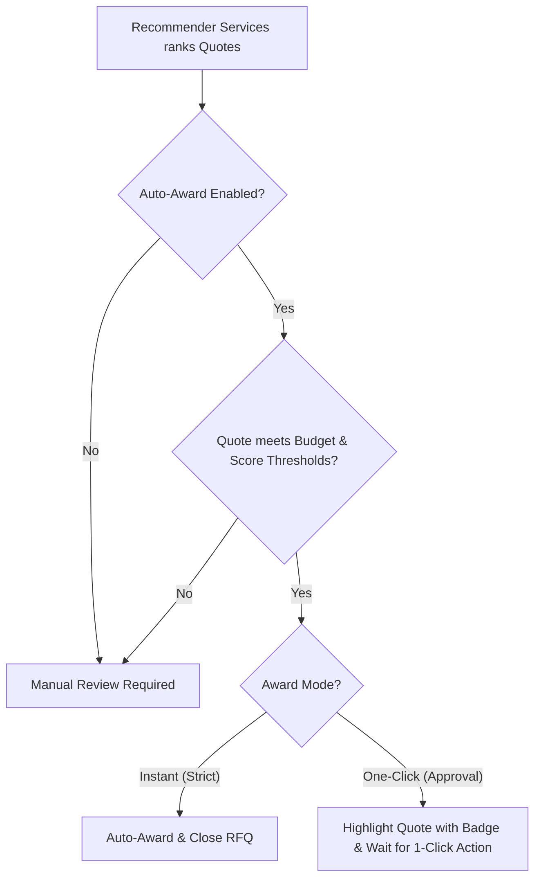

# Auctom AI-to-AI Procurement Marketplace: Product Roadmap & PRD

This document outlines the strategic plan to evolve **Auctom** from a mock simulation platform into a fully fledged, autonomous AI-to-AI manufacturing procurement marketplace.

---

## 🚀 Product Vision
**Auctom** is an autonomous B2B marketplace where custom manufacturing buyers and suppliers deploy AI agents to handle matchmaking, quotation, and contract awards. 

* **Buyers** define part requirements and set guardrails for auto-awarding.
* **Suppliers** set operational metrics and bidding strategies to let their agents autonomously generate and submit competitive bids.

---

## 🗺️ Feature Roadmap

### Phase 1: Supplier Agent Strategies & Freemium vs. Premium Quoting
We will transition the supplier's auto-bidding engine from randomized numbers into a strategic bidding assistant with two tiers:

| Tier | Name | Description | Pricing Model |
| :--- | :--- | :--- | :--- |
| **Freemium** | **Rules-Based Math Agent** | Calculates pricing and lead times using mathematical formulas based on the supplier's capacity, target profit margin, and current machine utilization. | Free (Included) |
| **Premium** | **Gemini AI Curated Agent** | Uses Gemini API to read drawing notes, analyze material complexity, and reason about pricing strategies to optimize chances of winning. | Subscription Model |

#### ⚙️ Supplier Strategy Parameters
Suppliers can configure the following strategy parameters:
* **Target Profit Margin ($M_t$):** Range: `5% - 100%`. Base markup applied on top of direct cost.
* **Machine Utilization / Occupancy ($U$):** Range: `0% - 100%`. As utilization increases, lead time and pricing increase (scarcity pricing).
* **Risk Tolerance ($R$):** Range: `0.0 - 1.0`. High tolerance reduces the contingency premium added for complex or high-risk specifications.

---

### Phase 2: Buyer Auto-Award Rules & Guardrails
Buyers gain control over how they receive and accept bids, choosing their desired level of automation:



#### ⚙️ Buyer Guardrail Settings
When publishing an RFQ, buyers configure:
1. **Auto-Award Mode:**
   * `disabled`: Final award is always manual.
   * `instant`: Automatically awards the contract the instant a quote meets the thresholds.
   * `one-click`: Flags the eligible quote with a high-visibility badge, waiting for a single click to accept.
2. **Target Budget ($B_t$):** The maximum total price the buyer is willing to accept.
3. **Minimum Recommendation Score ($S_{min}$):** Minimum ranking score calculated by the `recommender-service` (e.g., `0.8500`).

---

## 🛠️ Technical Design & Database Schema Updates

### Database Schema Alterations (`db/migrations`)
We need to update our PostgreSQL schema to support the new agent parameters:

```sql
-- Update supplier_profiles to support bidding strategies
ALTER TABLE supplier_profiles 
ADD COLUMN target_margin NUMERIC(4, 2) DEFAULT 0.20 CHECK (target_margin >= 0.05 AND target_margin <= 1.00),
ADD COLUMN utilization_rate NUMERIC(3, 2) DEFAULT 0.50 CHECK (utilization_rate >= 0.00 AND utilization_rate <= 1.00);

-- Update rfqs to support auto-award rules
ALTER TABLE rfqs
ADD COLUMN auto_award_mode VARCHAR(20) DEFAULT 'disabled' CHECK (auto_award_mode IN ('disabled', 'instant', 'one-click')),
ADD COLUMN target_budget NUMERIC(12, 2),
ADD COLUMN min_score_threshold NUMERIC(5, 4) DEFAULT 0.8000 CHECK (min_score_threshold >= 0.0000 AND min_score_threshold <= 1.0000);
```

### Microservice Updates

#### 1. `quote-service` (Python)
Update the quoting logic from pure random distributions to formulas including the supplier's parameters:
* **Cost formula:** 
  $$\text{Unit Price} = (\text{Direct Material/Labor Cost} \times (1 + \text{Target Margin})) \times (1 + (\text{Utilization Rate})^2 \times 0.3)$$
* **Lead time formula:** 
  $$\text{Lead Time} = \text{Base Lead Time} \times (1 + \text{Utilization Rate} \times 1.5)$$
* **Gemini Integration (Premium):** When the supplier is premium, call the Gemini API with the prompt:
  > *"You are the AI Sales Agent for [Company Name]. The buyer has requested a quote for [Part Name] (Quantity: [Qty]) with spec notes: '[Notes]'. Your company's machine utilization is [U]% and target margin is [M]%. Analyze the RFQ complexity and recommend a competitive total price, lead time, and risk assessment."*

#### 2. `go-api` (Go)
Add logic in the `/api/webhooks/status-callback` handler for the `ranked` event:
```go
if rfq.AutoAwardMode == "instant" && topQuote.Score >= rfq.MinScoreThreshold && topQuote.TotalPrice <= rfq.TargetBudget {
    // Perform auto-award transaction
    AwardRFQ(rfq.ID, topQuote.ID)
}
```

---

## 📈 User Acquisition & Retention Loop

1. **Free / Low Friction onboarding**: Let suppliers sign up, configure their basic parameters, and immediately see auto-bids running.
2. **Demonstrated Value**: Show suppliers exactly how close they were to winning (e.g. *"Your agent bid $500, but a competitor won at $460 due to lower lead time"*). This drives retention as suppliers fine-tune their parameters.
3. **Upsell to Premium**: Prompt suppliers to unlock the **Gemini AI Curated Agent** when they lose complex, high-margin bids that require custom design reasoning.
